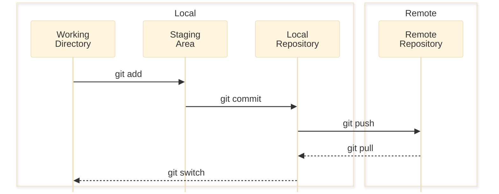

# Start git (2025-12-17)

## Git Basic

### Git이란? 

- Linus Torvalds가 개발한 분산형 버전관리 시스템
- 단순한 구조와 빠른 속도
- 분산형 저장소 지원
- 비선형적 개발(수많은 브랜치) 가능
- 여러 개발자들이 동시에 작업할 수 있어 생산성 증가

### Git Local & Remote Repository




### Git Configuration

```shell
git config --global user.name "{username}"
git config --global user.email "{emailaddr}"
git config --global core.editor "vim"
git config --global core.pager "cat"

git config --list

# 수정이 필요할 경우, ~/.gitconfig 파일 수정
```

### How to start

```shell
git clone {username/repo-addr}
cd {repo-addr}

vi README.md
git status
git add README.md
git commit
git push origin main
```

## Conventional Commits [v1.0.0](https://www.conventionalcommits.org/ko/v1.0.0/)

커밋 메시지에 사용자와 기계 모두가 이해할 수 있는 의미를 부여하기 위한 스펙

### Commit Message Structure

> <type>[optional scope]: <description>
>
> [optional body]
>
> [optional footer(s)]

### Commit Message Types

- fix: 버그 수정.
- feat: 새 기능(Feature) 추가.
- docs: 문서 작성 및 수정.
- style: 코드의 의미에 영향을 주지 않는 코드 정렬이나 포매팅.
- refactor: 기능 추가나 버그 수정이 아닌 코드 변경. (기능 모듈 구조 변경 등)
- perf: 성능 개선을 위한 코드 수정.
- test: test 코드 추가 혹은 업데이트.
- build: 빌드 시스템 혹은 외부 종속성에 영향을 미치는 변경 사항.
- ci: CI(Continuous Integration) 설정 파일이나 스크립트 수정.
- chore: src나 test 파일들을 변경하지 않는 다른 수정 사항.
- revert: 이전 커밋으로 되돌리기.

### 단절적 변경(BREAKING CHANGE)

- Commit이 기존 코드의 동작을 깨트리는 경우에 해당.
- type(scope) 뒤에 `!`를 붙여서 표기.
    ```markdown
        refactor(api)!: rename createUser to registerUser
    ```
- `BREAKING CHANGE` footer로 명시.
    ```markdown
        refactor(api): reanme creatUser to registerUser

        BREAKING CHANGE: createUser API has been renamed to registerUser.
    ```
- `!` 표기와 `BREAKING CHANGE` footer를 함께 사용하면 좋음.

## .gitignore

- git의 버전 관리 대상에서 제외시킬 파일이나 디렉토리를 명시하기 위한 파일
- gitignore를 프로젝트 목적에 맞게 생성해주는 사이트 [gitignore.io](https://gitignore.io)


```shell
# MacOS setup
.DS_Store

# Python cache file
.py[cdo]

# Credentials
Credentials/**
```

## Pre-commit [pre-commit.com](https://pre-commit.com)

commit 수행 전 체크해야 할 것들을 자동 수행하도록 도와주는 도구

```shell
pip install pre-commit
pre-commit --version
touch .pre-commit-config.yaml
# 직접 .pre-commit-config.yaml을 작성하거나 sample-config를 사용.
pre-commit sample-config > .pre-commit-config.yaml
pre-commit install
pre-commit run --all-files
```

## Git Branch

Stable 버전인 main branch로부터 분기점을 생성하여 독립적으로 기능 개발이나 테스트 가능

### Branch 명령어 및 옵션

- Local branch list: `git branch`
- Remote branch list: `git branch -r`
- All branch list: `git branch -a`
- Create new branch: `git branch {branch name}`
- Switch to branch: `git switch {branch name}`
- Delete branch: `git branch -D {branch name}`
- Push to remote: `git push -u origin {branch name}` (-u 옵션은 branch의 첫 push인 경우)

### Git Merge

특정 branch의 변경 사항을 현재 branch에 합치는 작업

```shell
# dev branch 생성 후 main.py 수정
git branch dev
git switch dev
vi main.py
git add main.py
git commit -m "fix!: Some fix"

# main branch 에서도 main.py 수정
git switch main
vi main.py
git add main.py
git commit -m "fix!: Any fix"

# main branch에 dev branch의 변경 사항 합치기
git merge dev
```

### Solve Merge Conflict

- 서로 다른 branch의 동일 file에 대한 변경 사항이 merge conflict 유발

```shell
# 충돌 발생한 파일을 열어서 문제 해결
vi {filename}
# =====, <<<<<, >>>>> 표시된 부분을 찾아서 수정하고 표식 제거

# 충돌 해결한 파일들 add, commit
git add {filename}
git commit
# commit 시 자동 생성된 commit message 그대로 사용

# 충돌 해결 후, merge된 branch는 제거
git branch -D dev
```

